# 📈 AI-Stock-Analyst

<div align="center">
  <h3>Analyze Global & Indian Equities using an Autonomous AI Boardroom.</h3>
</div>

---

## 🚀 Overview
This repository showcases an advanced **Multi-Agent Orchestration Framework** using **CrewAI**. Instead of a single chatbot answering questions, this project spins up an autonomous "Board of Directors" to analyze a specific company ticker and present a full investment recommendation.

✨ **Live Deployment:** [AI Stock Analyst](https://ai-stock-analyst-agent.streamlit.app)

## 🧠 The AI Boardroom

```mermaid
graph TD
    User([User Ticker Input]) --> UI[Streamlit UI]
    UI --> Crew{CrewAI Orchestrator}
    
    Crew --> A1[🕵️‍♂️ Research Analyst]
    Crew --> A2[📊 Financial Analyst]
    Crew --> A3[💼 Investment Advisor]
    
    A1 -.->|yfinance + Web Search| LLM[Groq: Llama 3.3 70B]
    A2 -.->|yfinance Balance Sheets| LLM
    A3 -.->|Synthesize Final Report| LLM
    
    LLM --> Crew
    Crew --> UI
```



The system delegates work sequentially to three specialized AI Agents:
1.  🕵️‍♂️ **Research Analyst:** Queries live internet data and Yahoo Finance for the latest news, market sentiment, and macroeconomic events affecting the ticker.
2.  📊 **Financial Analyst:** Fetches raw quantitative financial data (Income Statements & Balance Sheets) and performs mathematical operations to gauge financial health.
3.  💼 **Investment Advisor:** Synthesizes the qualitative research and quantitative financials to output a polished, final Buy/Hold/Sell recommendation report.

## 🛠️ Tech Stack & Architecture
We have completely stripped out restrictive paywalls (like `sec-api`) and heavy local execution layers to make this app cloud-ready, free, and blazing fast.

*   **Orchestration Engine:** `CrewAI`
*   **LLM Backend:** `Groq API` (Running `llama-3.3-70b-versatile` for near-instant inference).
*   **Data Pipelines:** `yfinance` (Free, zero-API key access to global market data, including NSE/BSE Indian Equities).
*   **Frontend:** `Streamlit` (Interactive Web UI).
*   **Environment Manager:** `uv` (Lightning-fast Python package management).

## 💻 Local Setup & Execution

### Prerequisites
1.  Install the blazing-fast Python environment manager: `curl -LsSf https://astral.sh/uv/install.sh | sh`
2.  Get a free API Key from [Groq Console](https://console.groq.com/).

### Installation
```bash
# Clone the repository
git clone https://github.com/yourusername/Dalal-Street-AI-Analyst.git
cd Dalal-Street-AI-Analyst

# Copy environment variables and insert your GROQ_API_KEY
cp .env.example .env

# Install dependencies and sync the environment via uv
uv sync
```

### Running the App
Spin up the interactive Streamlit UI:
```bash
uv run streamlit run app.py
```

### Supported Markets
Because this framework is powered by Yahoo Finance, you can analyze ANY ticker globally:
*   **US Tech:** `AAPL`, `AMZN`, `TSLA`
*   **Indian Equities:** `RELIANCE.NS`, `TCS.NS`, `INFY.BO`

---
*Built with ❤️ utilizing the latest standards in Autonomous GenAI Frameworks. (Note: Portions of this documentation were assisted by AI)*
